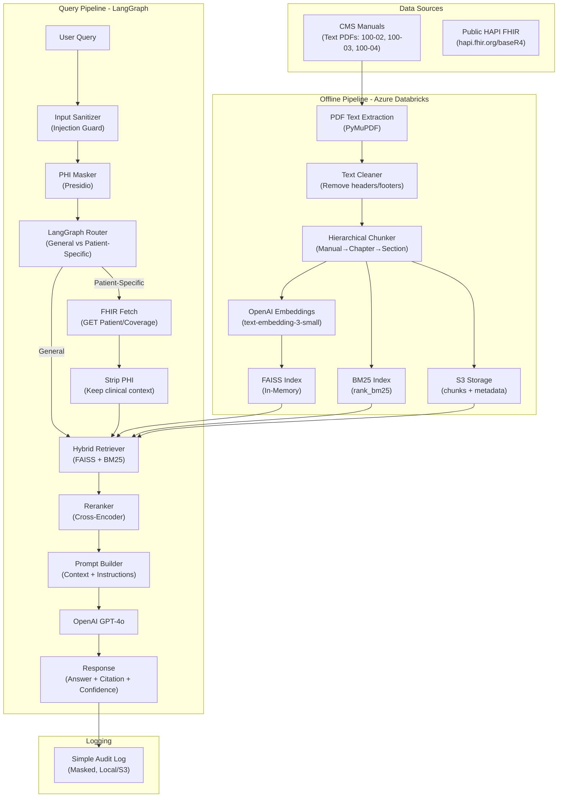
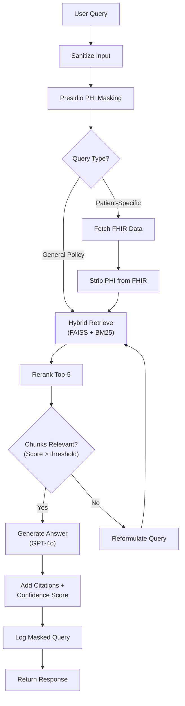

# Healthcare RAG Policy Navigator — MVP Architecture

## 1. Resolved Questions

| # | Question | Decision |
|---|----------|----------|
| 1 | **LLM** | OpenAI API (`gpt-4o`) |
| 2 | **Embeddings** | OpenAI API (`text-embedding-3-small`, 1536-dim) |
| 3 | **FHIR Server** | Public HAPI FHIR (`https://hapi.fhir.org/baseR4`) — no local server |
| 4 | **Vector DB** | In-memory FAISS |
| 5 | **Session** | In-memory Python dict with 15-min TTL |
| 6 | **Cloud** | AWS S3 (storage) + Azure Databricks (pipelines) |
| 7 | **Deployment** | TBD — local for MVP |
| 8 | **Eval Dataset** | Team-created, 50–100 Q&A pairs |

---

## 2. MVP Architecture — High-Level



---

## 3. Two Data Sources — How They're Used

| Aspect | CMS Manuals | FHIR Patient Data |
|--------|-------------|-------------------|
| **Type** | Text PDFs (3 manuals) | REST API (JSON) |
| **When processed** | Offline — ahead of time | At query time — simple GET call |
| **Embedded in FAISS?** | ✅ Yes | ❌ Never |
| **Stored?** | S3 (chunks + metadata) | Not stored — fetched, used, discarded |
| **Pipeline needed?** | Yes — Databricks notebooks | No pipeline — just a REST client function |
| **Contains PHI?** | No (public docs) | Yes — strip before sending to LLM |

> [!CAUTION]
> **FHIR data is never embedded or stored.** It's fetched via a simple API call at query time, stripped of PHI (name, DOB, etc.), and only the clinical context (conditions, medications, coverage type) is injected into the prompt.

---

## 4. Why Hybrid Retrieval + Reranking (Not Simple RAG or GraphRAG)

| Option | Verdict | Reasoning |
|--------|---------|-----------|
| Simple RAG (vector only) | ❌ | Misses exact terms like "§40.1.2" or "HCPCS G0179" |
| GraphRAG | ❌ Overkill | Needs knowledge graph construction — too much for MVP |
| **Hybrid + Rerank** | ✅ | BM25 catches exact terms; FAISS captures semantic meaning; reranker picks the best 5 |

**Implementation:**
1. FAISS: semantic similarity search → top 20 candidates
2. BM25: keyword match → top 20 candidates  
3. Reciprocal Rank Fusion (RRF): merge and deduplicate → top 15
4. Cross-encoder reranker: re-score against the query → top 5
5. These top 5 chunks go into the LLM prompt

---

## 5. Hierarchical Chunking Strategy (Validated)

Your chunking approach is correct. Here's the refined metadata schema:

```python
chunk = {
    "chunk_id": "100-02_ch7_s40.1_p42_001",     # Deterministic ID
    "parent_chunk_id": "100-02_ch7_s40",          # For parent context retrieval
    "manual_id": "100-02",
    "chapter_num": 7,
    "chapter_title": "Home Health Services",
    "section_title": "Covered Services - Skilled Nursing",
    "page_num": 42,
    "source_url": "https://cms.gov/...",
    "chunk_text": "Skilled nursing services are covered when...",
    "token_count": 487
}
```

- **~500 tokens per chunk, 50-token overlap** ← your numbers are good
- **Parent Document Retrieval**: Retrieve the child chunk for precision, but optionally include the parent section text in the LLM prompt for broader context
- **Skip tables** for MVP (they add parsing complexity with low retrieval value)

---

## 6. LangGraph Orchestration Flow



**Why LangGraph over a simple chain:**
- **Conditional routing** — general vs patient-specific queries take different paths
- **Self-correction loop** — if retrieved chunks score low, reformulate and retry (max 2 retries)
- **Presentation differentiator** — shows agentic thinking, not just linear pipeline

---

## 7. Answers to All Open Questions (from your notes)

**Q: Hash the policy ID during masking?**
> No. Policy IDs (100-02, §40.1) are public government references, not PHI. Only mask patient identifiers.

**Q: Show confidence score?**
> Yes. Two signals: (1) retrieval score (cosine similarity — immediate), (2) LLM self-assessment ("Rate confidence as High/Medium/Low based on provided context").

**Q: Show retrieval source?**
> Mandatory. Every response cites: Manual name + Chapter + Section + Page number.

**Q: HAPI FHIR vs FHIR Client?**
> Use public HAPI FHIR server (`https://hapi.fhir.org/baseR4`). Simple `requests.get()` calls. No local server needed.

**Q: Add LangGraph?**
> Yes — adds routing, self-correction, and grounding checks. See flow above.

**Q: Patient sessions?**
> In-memory Python dict with 15-min TTL. On expiry, all patient context is deleted. No Redis needed for MVP.

---

## 8. Output Format (Every Response)

```json
{
  "answer": "Home health nursing is covered under Medicare Part A when the patient is homebound and requires intermittent skilled nursing care...",
  "citations": [
    {
      "manual": "Medicare Benefit Policy Manual (100-02)",
      "chapter": "Chapter 7: Home Health Services",
      "section": "Section 40.1: Skilled Nursing",
      "page": 42
    }
  ],
  "confidence": {
    "level": "High",
    "retrieval_score": 0.87,
    "reasoning": "Multiple relevant sections retrieved with high similarity"
  },
  "patient_context_used": true,
  "session_id": "abc123"
}
```
