# Security & PHI Compliance — MVP

> [!NOTE]
> For MVP, we focus on **PHI protection** (the must-have) and defer enterprise security (RBAC, IAM, encryption-at-rest, audit WORM) to post-MVP.

## 1. What's In vs Out for MVP

| Security Feature | MVP? | Rationale |
|---|---|---|
| **Presidio PHI masking** (queries + logs) | ✅ Must-have | Core requirement — PHI must never reach LLM unmasked |
| **Input sanitization** (prompt injection) | ✅ Must-have | Prevents adversarial misuse in demo |
| **FHIR PHI stripping** | ✅ Must-have | Raw patient JSON must not go to OpenAI |
| **Simple audit log** (masked, local file/S3) | ✅ Simplified | JSON file per session — no WORM, no Object Lock |
| RBAC / IAM roles | ❌ Post-MVP | No multi-user access control needed for demo |
| Encryption at rest (S3 SSE) | ❌ Post-MVP | S3 default encryption is fine; no KMS setup |
| Rate limiting | ❌ Post-MVP | Single-user demo |
| JWT auth / API Gateway | ❌ Post-MVP | No user authentication for MVP |

---

## 2. PHI Handling Flow (MVP)

```mermaid
graph LR
    subgraph "Layer 1: Query Masking"
        Q["User Query<br/>(may contain PHI)"] --> PRESIDIO["Presidio Analyzer<br/>+ Anonymizer"]
        PRESIDIO --> SAFE_Q["Masked Query<br/>+ Deanon Map (in-memory)"]
    end

    subgraph "Layer 2: FHIR Data Scoping"
        SAFE_Q --> FHIR["FHIR API Call<br/>(GET Patient, Coverage)"]
        FHIR --> EXTRACT["Extract Only:<br/>conditions, meds,<br/>coverage type"]
        EXTRACT --> DROP["Drop:<br/>name, DOB, SSN,<br/>address, MRN"]
    end

    subgraph "Layer 3: LLM Call"
        DROP --> PROMPT["Prompt with<br/>masked data only"]
        PROMPT --> LLM["OpenAI GPT-4o"]
        LLM --> RESP["Response"]
    end

    subgraph "Layer 4: Output"
        RESP --> RESTORE["Restore masked<br/>tokens if needed"]
        RESTORE --> LOG["Log masked<br/>version only"]
    end
```



### Presidio Implementation (MVP Code)

```python
from presidio_analyzer import AnalyzerEngine
from presidio_anonymizer import AnonymizerEngine

analyzer = AnalyzerEngine()
anonymizer = AnonymizerEngine()

def mask_phi(text: str) -> tuple[str, dict]:
    """Mask PHI in user query. Returns masked text + deanon map."""
    results = analyzer.analyze(
        text=text,
        entities=[
            "PERSON", "PHONE_NUMBER", "EMAIL_ADDRESS",
            "US_SSN", "DATE_OF_BIRTH", "LOCATION",
            "MEDICAL_RECORD_NUMBER"
        ],
        language="en"
    )
    anonymized = anonymizer.anonymize(text=text, analyzer_results=results)
    
    # Build deanonymization map (kept in-memory only, never persisted)
    deanon_map = {}
    for item in anonymized.items:
        deanon_map[item.text] = text[item.start:item.end]
    
    return anonymized.text, deanon_map
```

### FHIR Data Stripping (MVP Code)

```python
import requests

HAPI_FHIR_BASE = "https://hapi.fhir.org/baseR4"

def fetch_patient_context(patient_id: str) -> dict:
    """Fetch patient data and strip PHI. Return only clinical context."""
    
    # Fetch relevant FHIR resources
    patient = requests.get(f"{HAPI_FHIR_BASE}/Patient/{patient_id}").json()
    conditions = requests.get(f"{HAPI_FHIR_BASE}/Condition?patient={patient_id}").json()
    coverage = requests.get(f"{HAPI_FHIR_BASE}/Coverage?patient={patient_id}").json()
    medications = requests.get(f"{HAPI_FHIR_BASE}/MedicationRequest?patient={patient_id}").json()
    
    # Extract ONLY clinical context — NO identifiers
    clinical_summary = {
        "conditions": extract_condition_names(conditions),      # ["Diabetes", "Hypertension"]
        "medications": extract_medication_names(medications),    # ["Metformin", "Lisinopril"]
        "coverage_type": extract_coverage_type(coverage),       # "Medicare Part A"
        "age_range": get_age_range(patient),                    # "65-70" (not exact DOB)
    }
    # patient name, DOB, SSN, address — all DROPPED here, never forwarded
    return clinical_summary
```

### What Gets Masked vs. What Doesn't

| Data Element | Mask? | Why |
|---|---|---|
| Patient name, DOB, SSN, MRN | ✅ Always | HIPAA Safe Harbor identifiers |
| Address, phone, email | ✅ Always | HIPAA Safe Harbor identifiers |
| Diagnosis names (e.g., "diabetes") | ❌ No | Needed for policy lookup |
| Medication names | ❌ No | Needed for coverage determination |
| Policy/manual section IDs | ❌ No | Public government references |
| Insurance plan ID | ✅ Yes | Can be linked to individual |
| Age (converted to range) | ❌ No | "65-70" is not PHI; exact DOB is |

---

## 3. Prompt Injection Defense (MVP)

```python
import re

INJECTION_PATTERNS = [
    r"ignore.*(?:previous|above|all).*instructions",
    r"you are now",
    r"system prompt",
    r"reveal.*(?:prompt|instructions|context)",
    r"pretend you",
    r"jailbreak",
    r"disregard",
    r"forget everything",
]

def check_injection(query: str) -> bool:
    """Returns True if query looks like a prompt injection attempt."""
    query_lower = query.lower()
    for pattern in INJECTION_PATTERNS:
        if re.search(pattern, query_lower):
            return True
    return False

# Usage in pipeline:
if check_injection(user_query):
    return {"error": "This query has been flagged for review.", "blocked": True}
```

---

## 4. Simple Audit Log (MVP)

For MVP, just append masked logs to a JSON Lines file:

```python
import json
from datetime import datetime

def log_interaction(request_id, masked_query, chunks_used, response_masked, confidence):
    log_entry = {
        "request_id": request_id,
        "timestamp": datetime.utcnow().isoformat(),
        "query_masked": masked_query,        # Already Presidio-masked
        "chunks_retrieved": [c["chunk_id"] for c in chunks_used],
        "confidence_score": confidence,
        "response_preview": response_masked[:200],  # First 200 chars only
    }
    
    # Local file for MVP; upload to S3 post-MVP
    with open("audit_log.jsonl", "a") as f:
        f.write(json.dumps(log_entry) + "\n")
```

---

## 5. Vulnerabilities to Mention in Presentation

| Risk | MVP Mitigation | Production Upgrade |
|---|---|---|
| PHI in user query → sent to OpenAI | Presidio masking before LLM call | Add OpenAI data processing agreement |
| Prompt injection | Regex-based blocker | Add LLM classifier as second layer |
| FHIR raw data exposure | Strip PHI, keep clinical context only | Add field-level encryption |
| Logs contain PHI | Log only masked versions | S3 Object Lock + WORM |
| No auth on API | Single-user demo | OAuth2 + API Gateway |
| OpenAI sees query data | Masked queries reduce risk | Self-hosted LLM or Azure OpenAI with BAA |

> [!IMPORTANT]
> **Key talking point for presentation:** "We identified these risks, implemented PHI masking as the critical control for MVP, and have a clear upgrade path for production hardening."
