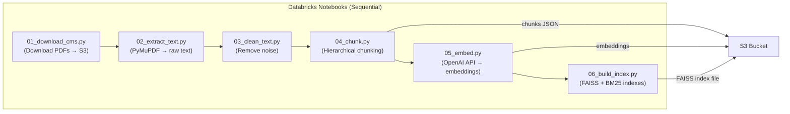

# Data Engineering Plan — MVP

> [!NOTE]
> Simplified for MVP: No Unity Catalog, no GPU clusters, no streaming. Just Databricks notebooks + S3 folders.

## 1. Databricks Pipeline (CPU-Only Notebooks)

All embedding is done via **OpenAI API** — no local GPU needed.



### Notebook Details

| Notebook | Input | Output | Cluster | Notes |
|----------|-------|--------|---------|-------|
| `01_download_cms.py` | CMS URLs | PDFs in S3 `/raw/` | CPU (small) | Script downloads selected chapters |
| `02_extract_text.py` | PDFs from S3 | Raw text (JSON/Parquet) in S3 `/processed/` | CPU (small) | PyMuPDF — text-only PDFs, skip tables |
| `03_clean_text.py` | Raw text | Cleaned text | CPU (small) | Remove headers, footers, page numbers, OCR junk, fix hyphenation |
| `04_chunk.py` | Cleaned text | Chunks with metadata (JSON) | CPU (small) | Hierarchical: detect headings via regex/font, ~500 tokens, 50 overlap |
| `05_embed.py` | Chunks JSON | Embeddings array | CPU (small) | OpenAI `text-embedding-3-small` API. Batch with rate limiting |
| `06_build_index.py` | Embeddings | FAISS `.index` file + BM25 pickle | CPU (small) | `faiss.IndexFlatIP` for cosine similarity; `rank_bm25` for BM25 |

> [!TIP]
> **Run these sequentially as a Databricks Workflow** (DAG). Each notebook reads from S3, processes, writes back to S3. Total runtime: ~15-30 min for 3 manuals.

### Embedding with OpenAI API (Rate-Limited Batching)

```python
import openai
import time

def embed_chunks(chunks: list[dict], batch_size=100) -> list[list[float]]:
    """Embed chunks using OpenAI API with rate limiting."""
    all_embeddings = []
    
    for i in range(0, len(chunks), batch_size):
        batch_texts = [c["chunk_text"] for c in chunks[i:i+batch_size]]
        
        response = openai.embeddings.create(
            model="text-embedding-3-small",
            input=batch_texts
        )
        
        batch_embeddings = [item.embedding for item in response.data]
        all_embeddings.extend(batch_embeddings)
        
        # Rate limit: ~3000 RPM for text-embedding-3-small
        if i + batch_size < len(chunks):
            time.sleep(1)
    
    return all_embeddings
```

---

## 2. S3 Storage — Simplified

```
s3://healthcare-rag-mvp/
├── raw/                      # Downloaded CMS PDFs
│   ├── 100-02/
│   │   ├── chapter-01.pdf
│   │   ├── chapter-07.pdf
│   │   └── ...
│   ├── 100-03/
│   └── 100-04/
│
├── processed/                # Pipeline outputs
│   ├── chunks.json           # All chunks with metadata
│   ├── embeddings.npy        # NumPy array of embeddings
│   ├── faiss_index.bin       # FAISS index file
│   ├── bm25_index.pkl        # BM25 index (pickled)
│   └── chunk_id_map.json     # Maps FAISS integer IDs → chunk_ids
│
└── logs/                     # Audit logs (masked)
    └── audit_log.jsonl
```

**That's it. 3 folders.** No medallion architecture for MVP — just raw → processed → logs.

---

## 3. Batch Only — No Streaming

| Data Source | Strategy | Notes |
|---|---|---|
| CMS Manuals | **One-time batch** | Download once, process once. CMS manuals won't change during the project |
| FHIR Data | **On-demand API call** | Not a pipeline — just `requests.get()` at query time |
| Audit Logs | **Append to file** | Simple JSONL append. Upload to S3 periodically if needed |

No CDC, no Kafka, no Kinesis. The data is static.

---

## 4. Metadata — Simple JSON (No Unity Catalog)

Instead of Unity Catalog Delta Tables, store metadata alongside chunks in a simple JSON:

```python
# chunks.json structure
[
    {
        "chunk_id": "100-02_ch7_s40.1_p42_001",
        "parent_chunk_id": "100-02_ch7_s40",
        "manual_id": "100-02",
        "manual_title": "Medicare Benefit Policy Manual",
        "chapter_num": 7,
        "chapter_title": "Home Health Services",
        "section_title": "Covered Services - Skilled Nursing",
        "page_num": 42,
        "source_url": "https://www.cms.gov/...",
        "chunk_text": "Skilled nursing services are covered when...",
        "token_count": 487
    },
    ...
]
```

```python
# chunk_id_map.json — maps FAISS integer index → chunk_id
{
    "0": "100-02_ch7_s40.1_p42_001",
    "1": "100-02_ch7_s40.2_p43_001",
    ...
}
```

### Loading at Query Time

```python
import faiss
import json
import numpy as np
import pickle

# Load once at app startup
faiss_index = faiss.read_index("faiss_index.bin")
with open("chunks.json") as f:
    chunks = {c["chunk_id"]: c for c in json.load(f)}
with open("chunk_id_map.json") as f:
    id_map = json.load(f)
with open("bm25_index.pkl", "rb") as f:
    bm25 = pickle.load(f)
```

---

## 5. Versioning — MVP Approach

| What | How |
|------|-----|
| Code | Git (see collaboration plan) |
| FAISS index | Filename: `faiss_index_v1.bin`. Overwrite on re-build |
| Chunks | `chunks_v1.json`. Keep previous version as backup |
| Embeddings | `embeddings_v1.npy`. Must re-embed everything if model changes |

> For MVP, version suffixes are enough. No need for symlinks or automated rollback.

---

## 6. What's Deferred to Post-MVP

| Feature | Why Deferred |
|---------|-------------|
| Unity Catalog | Governance overhead not needed for 3 manuals |
| Delta Tables | JSON + Parquet is sufficient for MVP scale |
| GPU clusters | Using OpenAI API — all compute is remote |
| Medallion architecture | Over-engineering for static, one-time processed data |
| Embedding versioning automation | Only 1 version needed for MVP |
| CDC / streaming | Data doesn't change |
