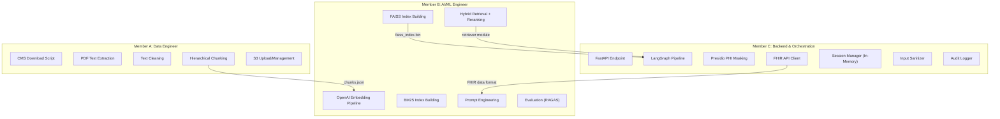

# Collaboration Plan — MVP (Team of 3)

## 1. Role Split



### Integration Contracts (Agree on Day 1)

| Interface | Producer | Consumer | Contract |
|-----------|----------|----------|----------|
| Chunks file | Member A | Member B | `chunks.json` — list of dicts with schema from data engineering doc |
| FAISS index + ID map | Member B | Member C | `faiss_index.bin` + `chunk_id_map.json` |
| `retrieve()` function | Member B | Member C | `retrieve(query: str, top_k: int = 5) -> list[dict]` returning chunk dicts with scores |
| FHIR patient summary | Member C | Member B (prompts) | `{"conditions": [...], "medications": [...], "coverage_type": "..."}` |
| `mask_phi()` function | Member C | All | `mask_phi(text: str) -> tuple[str, dict]` |

---

## 2. Git Strategy

```
main                    ← Protected. Merge only via PR with 1 approval.
├── develop             ← Integration branch.
│   ├── feature/cms-download-pipeline      (Member A)
│   ├── feature/text-extraction-cleaning   (Member A)
│   ├── feature/chunking                   (Member A)
│   ├── feature/embedding-faiss            (Member B)
│   ├── feature/hybrid-retrieval           (Member B)
│   ├── feature/prompt-engineering         (Member B)
│   ├── feature/fastapi-langgraph          (Member C)
│   ├── feature/presidio-fhir             (Member C)
│   └── feature/session-logging            (Member C)
└── releases/v1.0       ← Tagged for presentation
```

**Simple rules:**
- Feature branches named `feature/<what-it-does>`
- PRs need 1 review (keep it fast — 15 min max)
- Each member owns their directory — minimal merge conflicts

---

## 3. Sprint Plan (5 Days)

| Day | Member A (Data) | Member B (AI/ML) | Member C (Backend) | Checkpoint |
|-----|----------------|-------------------|--------------------|-----------| 
| **1** | CMS download script + S3 bucket setup | Set up OpenAI embedding PoC + FAISS test | FastAPI skeleton + Presidio setup | ✅ Agree on contracts + mock data |
| **2** | PDF extraction + text cleaning | Embedding pipeline on sample chunks | FHIR client + PHI stripping + LangGraph skeleton | ✅ A delivers 10 sample chunks to B |
| **3** | Hierarchical chunking (full corpus) | FAISS + BM25 index build, hybrid retriever | LangGraph routing (general vs patient-specific) | ✅ B tests retriever with real chunks |
| **4** | Help with eval dataset (Q&A pairs) | Reranking + prompt engineering + integration | End-to-end integration + session + logging | ✅ **Full pipeline works end-to-end** |
| **5** | Eval dataset finalization | RAGAS evaluation run + metrics | Edge case handling + demo prep | ✅ **Demo dry run** |

### Day 1 Mock Data (Unblocks Everyone)

Member A creates this on Day 1 so B and C can start immediately:

```python
# mock_chunks.json — 10 sample chunks with correct schema
[
    {
        "chunk_id": "100-02_ch7_s40.1_p42_001",
        "parent_chunk_id": "100-02_ch7_s40",
        "manual_id": "100-02",
        "chapter_num": 7,
        "chapter_title": "Home Health Services",
        "section_title": "Skilled Nursing Requirements",
        "page_num": 42,
        "source_url": "https://www.cms.gov/...",
        "chunk_text": "To qualify for Medicare home health services, a patient must be confined to the home...",
        "token_count": 150
    }
]
```

---

## 4. Avoiding Blockers

| Risk | Mitigation |
|------|-----------|
| A's chunks not ready → B blocked | B uses `mock_chunks.json` (10 chunks) from Day 1 |
| FHIR public server is slow/down | C caches a few sample FHIR responses as JSON files for offline dev |
| OpenAI rate limits during embedding | Batch 100 chunks/request, 1-sec delay between batches |
| Merge conflicts | Each member owns separate dirs: `data/`, `retrieval/`, `api/` |
| Databricks access not ready | All notebooks also runnable locally as Python scripts |

---

## 5. Project Directory Structure

```
project_rag_ai/
├── data/                        # Member A owns
│   ├── download_cms.py
│   ├── extract_text.py
│   ├── clean_text.py
│   ├── chunk_hierarchical.py
│   └── mock_chunks.json         # Day 1 mock for unblocking
│
├── retrieval/                   # Member B owns
│   ├── embed_chunks.py          # OpenAI embedding pipeline
│   ├── build_faiss_index.py
│   ├── build_bm25_index.py
│   ├── hybrid_retriever.py      # FAISS + BM25 + RRF
│   ├── reranker.py              # Cross-encoder reranking
│   └── prompts/
│       ├── system_prompt.txt
│       └── few_shot_examples.json
│
├── api/                         # Member C owns
│   ├── main.py                  # FastAPI app
│   ├── langgraph_pipeline.py    # LangGraph orchestration
│   ├── phi_masker.py            # Presidio integration
│   ├── fhir_client.py           # HAPI FHIR REST client
│   ├── session_manager.py       # In-memory sessions with TTL
│   ├── input_sanitizer.py       # Prompt injection defense
│   └── audit_logger.py          # Simple JSONL logger
│
├── evaluation/                  # Member B + A
│   ├── eval_dataset.json        # 50-100 Q&A pairs
│   ├── run_ragas.py
│   └── results/
│
├── notebooks/                   # Databricks versions of data/ scripts
│   ├── 01_download_cms.py
│   ├── 02_extract_text.py
│   ├── 03_clean_text.py
│   ├── 04_chunk.py
│   ├── 05_embed.py
│   └── 06_build_index.py
│
├── config/
│   ├── settings.py              # All config: S3 paths, model names, etc.
│   └── .env.template            # OPENAI_API_KEY, S3 creds
│
├── tests/                       # Basic tests
├── docs/                        # These architecture documents
├── requirements.txt
└── README.md
```
